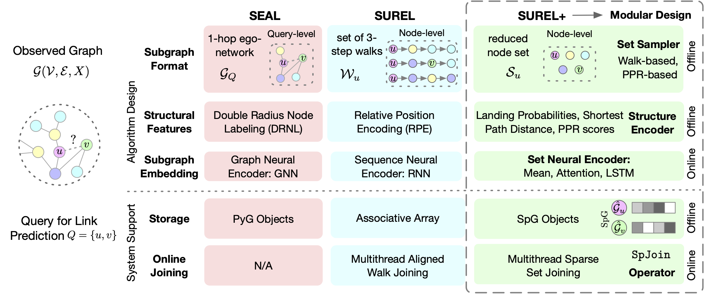

<h1 align="center">SUREL+: Moving from Walks to Sets for Scalable Subgraph-based Graph Representation Learning</h1>

<p align="center">
    <a href="https://arxiv.org/pdf/2303.03379.pdf"></a>
    <a href="https://github.com/Graph-COM/SUREL_Plus"></a>
    <a href="https://github.com/Graph-COM/SUREL_Plus/blob/main/LICENSE"></a>
    <a href="https://ogb.stanford.edu/docs/leader_linkprop/"></a>
    <a href="https://github.com/Graph-COM/SUREL_PLUS/tree/main/subg_acc"></a>
    <a href="https://hits.seeyoufarm.com"></a>
</p>

SUREL+ is a novel set-based computation framework for scaling subgraph-based GRL to industry-level graphs. It is the first time that SGRL is successfully deployed on billion-edge graphs. SUREL+ decomposes costly query-specific subgraph extraction into multiple node-level set sampling, where their joint set can act as proxies of queried subgraphs to make predictions for multiple queries.

SUREL+ benefits from the reusability of sampled node sets across different queries, and its set form substantially reduces both memory and computational cost by eliminating heavy node duplication from walk-based sampling.

SUREL+ designs a dedicated sparse storage **SpG** and a sparse join operator **SpJoin** to handle the irregular-sized node sets. It adopts a modular design, where users can flexibly choose different set samplers, structure encoders and set neural encoders to suit their own SGRL tasks.

<p align="center"></p> 

Currently, SUREL+ framework supports:
- Large-scale graph ML tasks: link prediction / relation-type prediction / higher-order pattern prediction
- Preprocessing and training on nine datasets in Open Graph Benchmark ([OGB](https://ogb.stanford.edu/docs/home/)) format
- Flexible modules:
  - Set Samplers: walk-based, metric-based
  - Structure Encoders: Landing Probabilities, Shortest Path Distance, PPR scores
  - Neural Set Encoders: MLP+mean pooling, LSTM-based, Attention-based
- Single GPU training and evaluation
- Structural Features + Node Features

## Updates ##
**May 15, 2023:**
- support SubGAcc v2.3 for billion-edge graphs
- add two industry-level graph benchmarks
  * [criteo-click](https://purdue.box.com/v/SGRLDataCriteoClick) with 16.5M records of online banner ads clicking
  * [twitter-follower](https://purdue.box.com/v/SGRLDataTwitterFollower) with 1.5B following relations of users

**Mar. 1, 2023:**
- support SubGAcc v2.2 and ogbl-vessel v1.1
- better logger function
- add model checkpoint and inference only mode

## Requirements ##
(Other versions may work, but are untested)
* Ubuntu 20.04
* CUDA >= 11.3
* python >= 3.8
* 1.11.0 <= pytorch <= 1.12.0 

## SGRL Environment Setup ##

Requirements: Python >= 3.8, [Anaconda3](https://www.anaconda.com/)

- Update conda:
```bash
conda update -n base -c defaults conda
```

- Install basic dependencies to virtual environment and activate it: 
```bash
conda env create -f environment.yml
conda activate sgrl-env
```

- Update: SUREL now support PyTorch 1.12.1 and PyG 2.2.0 with pyg-lib. To install them, simply run
```bash
conda install pytorch==1.12.1 torchvision==0.13.1 torchaudio==0.12.1 cudatoolkit=11.3 -c pytorch
conda install pyg -c pyg
pip install pyg-lib -f https://data.pyg.org/whl/torch-1.12.0+cu113.html
```

For more details, please refer to the [PyTorch](https://pytorch.org/), [PyTorch Geometric](https://pytorch-geometric.readthedocs.io/en/latest/notes/installation.html) and [pyg-lib](https://github.com/pyg-team/pyg-lib). The code of this repository is lately tested with Python 3.10.9 + PyTorch 1.12.1 (CUDA 11.3) + torch-geometric 2.2.0.

## Quick Start

1. Install required version of PyTorch that is compatible with your CUDA driver

2. Clone the repository `git clone https://github.com/Graph-COM/SUREL_Plus.git`

3. Build and install the [SubGAcc](https://github.com/VeritasYin/subg_acc) library `cd subg_acc;python3 setup.py install`

- To train **SUREL+** for link prediction on `collab` with LP/LSTM:
```bash
python main.py --dataset ogbl-collab --metric Hits --sencoder LP --num_steps 3 --num_walks 200 --aggr lstm --use_val
```

- To train **SUREL+** for link prediction on `ppa` with LP/Attn:

```bash
python main.py --dataset ogbl-ppa --metric Hits --sencoder LP --num_steps 4 --num_walks 200 --k 20 --aggr attn
```

- To train **SUREL+** for link prediction on `citation2` with PPR/Mean:
```bash
python main.py --dataset ogbl-citation2 --metric MRR --sencoder PPR --topk 100  --aggr mean
```

- To train **SUREL+** for `vessel` prediction with LP/Mean:
```bash
python main.py --dataset ogbl-vessel --metric AUC --sencoder LP --num_steps 2 --num_walks 50 --k 5 --aggr mean --use_raw --dropout 0.2
```

- To train **SUREL+** for relation type prediction on `MAG(A-P)`:
```bash
python main.py --dataset mag --relation write --metric MRR --sencoder LP --num_steps 3 --num_walks 100
```

- To train **SUREL+** for higher-order pattern prediction on `DBLP`:
```bash
python main_horder.py --dataset DBLP-coauthor --metric MRR --num_steps 3 --num_walks 100 
```

- All detailed training logs can be found at `<log_dir>/<dataset>/<training-timestamp>.log`, and the saved checkpoint is under the `model` subfolder.


## Usage
```
usage: main.py [-h] [--device DEVICE] [--log_steps LOG_STEPS] [--num_layers NUM_LAYERS]
               [--hidden_channels HIDDEN_CHANNELS] [--dropout DROPOUT]
               [--batch_size BATCH_SIZE] [--lr LR] [--train_ratio TRAIN_RATIO]
               [--valid_perc VALID_PERC] [--epochs EPOCHS] [--eval_steps EVAL_STEPS]
               [--early_stop EARLY_STOP] [--runs RUNS] [--seed SEED] [--alpha ALPHA]
               [--eps EPS] [--topk TOPK] [--num_walks NUM_WALKS]
               [--num_steps NUM_STEPS] [--k K] [--nthread NTHREAD]
               [--dataset {ogbl-ppa,ogbl-ddi,ogbl-citation2,ogbl-collab,ogbl-vessel,mag}]
               [--relation {write,cite}] [--metric {AUC,MRR,Hits}]
               [--aggrs {mean,lstm,attn}] [--sencoder {LP,PPR,SPD,DEG}] [--use_raw]
               [--use_weight] [--use_val] [--use_pretrain] [--load_ppr] [--save_ppr]
               [--inf_only] [--log_dir LOG_DIR] [--load_model LOAD_MODEL] [--debug]
```

<details>
  <summary>Optional Arguments</summary> 
  
```
optional arguments:
  -h, --help            show this help message and exit
  --device DEVICE
  --log_steps LOG_STEPS
  --num_layers NUM_LAYERS
  --hidden_channels HIDDEN_CHANNELS
  --dropout DROPOUT
  --batch_size BATCH_SIZE
  --lr LR
  --train_ratio TRAIN_RATIO
  --valid_perc VALID_PERC
  --epochs EPOCHS
  --eval_steps EVAL_STEPS
  --early_stop EARLY_STOP
  --runs RUNS
  --seed SEED           seed to initialize all the random modules
  --alpha ALPHA         teleport probability in PPR
  --eps EPS             precision of PPR approx
  --topk TOPK           sample size of node set
  --num_walks NUM_WALKS
                        number of walks
  --num_steps NUM_STEPS
                        step of walks
  --k K                 negative samples
  --nthread NTHREAD     number of threads
  --dataset {ogbl-ppa,ogbl-ddi,ogbl-citation2,ogbl-collab,ogbl-vessel,mag}
                        dataset name
  --relation {write,cite}
                        relation type
  --metric {AUC,MRR,Hits}
                        metric for evaluating performance
  --aggrs {mean,lstm,attn}
                        type of set neural encoder
  --sencoder {LP,PPR,SPD,DEG}
                        type of structure encoder
  --use_raw             whether to use raw features
  --use_weight          whether to use edge weight
  --use_val             whether to use validation as input
  --use_pretrain        whether to load pretrained embedding
  --load_ppr            whether to load precomputed ppr
  --save_ppr            whether to save calculated ppr
  --inf_only            whether to perform inference only
  --log_dir LOG_DIR     log directory
  --load_model LOAD_MODEL
                        saved model path
  --debug               whether to use debug mode
```
</details>
